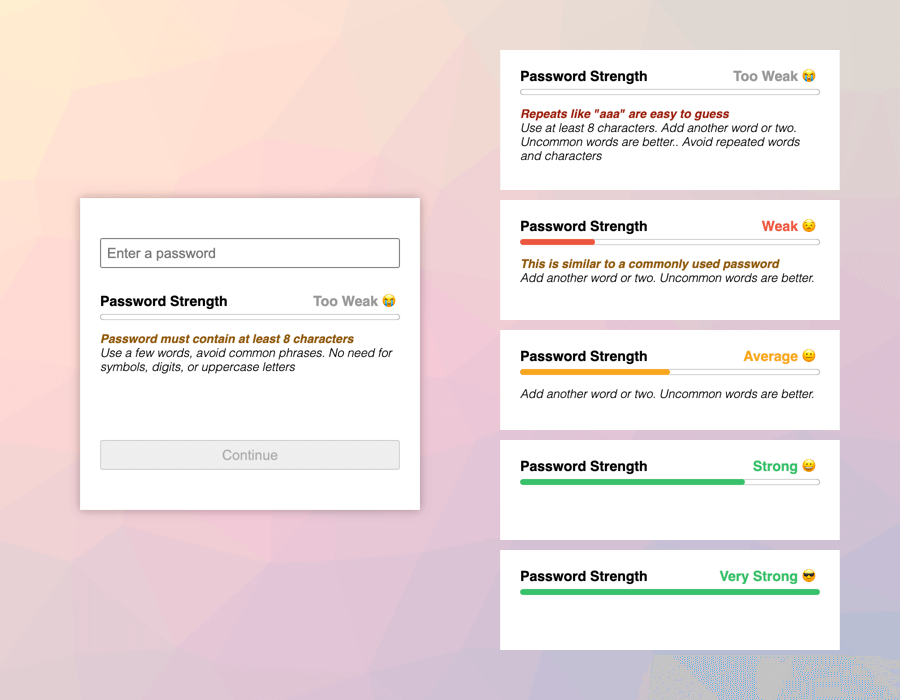

# Password Strength Component

> generic password strength component



## Installation

This module is installed via npm:

``` bash
$ npm install password-strength-component
```

or by downloading and using the files in the `dist` folder.

## Usage

### Importing the component to use.

There are 2 transpiled versions of the component that can be used.

* UDM (Universal Module Definition) - works as AMD (Asynchronous Module Definition) for module
  loaders like RequireJS, CJS (CommonJS) for node and other bundlers and IIFE (a self-executing
  function suitable for direct inclusion as a `<script>` tag).

  * `dist/component.js` -- this is the "main" version that will be used with node require etc...
  * `dist/component.min.js` -- minified version for the browser.

* ESM (ECMAScript Module) - can be used anywhere module imports are supported.

  * `dist/component.esm.js` -- this is the "module" version that will be used with node module
    imports etc...
  * `dist/component.esm.min.js` -- minified version for the browser.

### Examples

#### standard node js require
```js
// this should include dist/component.js (non minified udm version)
const mountPasswordStrengthComponent = require('password-strength-component');
const update = mountPasswordStrengthComponent(container, opts);
```

#### node js module based imports
```js
// this should include dist/component.esm.js (non minified esm version)
import mountPasswordStrengthComponent from 'password-strength-component';
const update = mountPasswordStrengthComponent(container, opts);
```

#### browser include with global function
```html
<script src="dist/component.min.js"></script>
<script>
  const update = mountPasswordStrengthComponent(container, opts);
</script>
```

#### browser that supports modules
```html
<script type="module">
  import mountPasswordStrengthComponent from 'dist/component.esm.min.js';
  const update = mountPasswordStrengthComponent(container, opts);
</script>
```

#### show/hide password in set password field

The follow snippets illustrate how you can give the user the ability to show/hide their password when they are setting a  new password.  This can be a good idea so that the user can understand why/why not their password is strong/weak without having to deal with the fact that they may have mistyped and not know it.

```html
Password: <input type="password" value="" id="password">
<input type="checkbox" onclick="toggleShowHide()">Show Password
```

```js
function toggleShowHide () {
  var x = document.getElementById("password");
  x.type = x.type === "password" ? 'text' : 'password';
}
```

### Creating and updating the component.

The `mountPasswordStrengthComponent` is used to create the DOM elements required to show the
password strength info and will return function that can be used to update (and get the password
strength) of the provided password.

```js
const opts = {
  // Where to load the main zxcvbn.js lib from (either a reliable cdn or
  // another location of your own choosing.
  src: 'https://cdnjs.cloudflare.com/ajax/libs/zxcvbn/4.4.2/zxcvbn.js',

  // The integrity checksum to make sure the zxcvbn.js lib is what you expect
  // it to be and hasn't been tampered with by any nefarious individuals.
  integrity: 'sha512-...'

  // Checksums can be created using a command like
  // cat zxcvbn.js | openssl dgst -sha512 -binary | openssl base64 -A
};

const container = document.querySelector('#demo');

// Create the password strength component in the provided container element.
// This also returns an update function that can be used to update the display
// based on the password you give it.
const update = mountPasswordStrengthComponent(container, opts);

const input = document.querySelector('#password');
input.addEventListener('input', async event => {
  const strength = await update(event.target.value);

  // The "update" function is async and will update the component display as
  // well as returning the strength of the password so that you can do any
  // validation you require based on password strength...
  // ie. enabling or disabling the submit button if the password isn't good
  // enough.
  const button = document.querySelector('#submit');
  button.disabled = strength < 1;
});
```

### Styles

Along with the js file there is also a `dist/style.css` that provides basic styling that can be
changed/extended with your own CSS rules being applied afterwards.

Alternatively you could use the `src/style.less` base file with your own custom colors to compile
your own CSS file.

```less
@import './src/style.less';
// Override any or all of the variables you find at the top of the style.less
// file. This is just a few of them...
@ns-password-strength-too-weak-color: #999;
@ns-password-strength-weak-color: red;
@ns-password-strength-average-color: orange;
@ns-password-strength-strong-color: green;
```

### Usage with other frameworks

Hopefully this should be fairly easily integrated into other frameworks.

ie. angularjs component might look something like this

```js
import angular from 'angular';
import mountPasswordStrengthComponent from 'password-strength-component';

const passwordStrengthComponent = angular.module('ns.password.strength', []);
passwordStrengtComponent.component('passwordStrength', {
  bindings: {
    password: '<',
    passwordStrength: '='
  },
  controller: ['$element', '$q', function ($element, $q) {
    const update = mountPasswordStrengthComponent($element.get(0));
    this.$onChanges = changes => {
      if (!changes.password) return;
      $q.when(update(this.password)).then(strength => {
        this.passwordStrength = strength;
      });
    }
  }]
});

export default passwordStrengthComponent;
```

## Contributing

### Prerequisites

```
$ pip install pre-commit
```

### Installation

```
$ pre-commit install --install-hooks
```

## License

The BSD License

Copyright (c) 2020, Andrew Harris

All rights reserved.

Redistribution and use in source and binary forms, with or without modification,
are permitted provided that the following conditions are met:

* Redistributions of source code must retain the above copyright notice, this
  list of conditions and the following disclaimer.

* Redistributions in binary form must reproduce the above copyright notice, this
  list of conditions and the following disclaimer in the documentation and/or
  other materials provided with the distribution.

* Neither the name of the copyright holder nor the names of its
  contributors may be used to endorse or promote products derived from
  this software without specific prior written permission.

THIS SOFTWARE IS PROVIDED BY THE COPYRIGHT HOLDERS AND CONTRIBUTORS "AS IS" AND
ANY EXPRESS OR IMPLIED WARRANTIES, INCLUDING, BUT NOT LIMITED TO, THE IMPLIED
WARRANTIES OF MERCHANTABILITY AND FITNESS FOR A PARTICULAR PURPOSE ARE
DISCLAIMED. IN NO EVENT SHALL THE COPYRIGHT HOLDER OR CONTRIBUTORS BE LIABLE FOR
ANY DIRECT, INDIRECT, INCIDENTAL, SPECIAL, EXEMPLARY, OR CONSEQUENTIAL DAMAGES
(INCLUDING, BUT NOT LIMITED TO, PROCUREMENT OF SUBSTITUTE GOODS OR SERVICES;
LOSS OF USE, DATA, OR PROFITS; OR BUSINESS INTERRUPTION) HOWEVER CAUSED AND ON
ANY THEORY OF LIABILITY, WHETHER IN CONTRACT, STRICT LIABILITY, OR TORT
(INCLUDING NEGLIGENCE OR OTHERWISE) ARISING IN ANY WAY OUT OF THE USE OF THIS
SOFTWARE, EVEN IF ADVISED OF THE POSSIBILITY OF SUCH DAMAGE.
